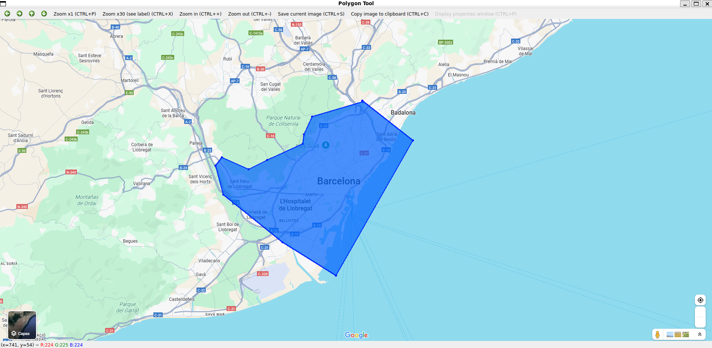
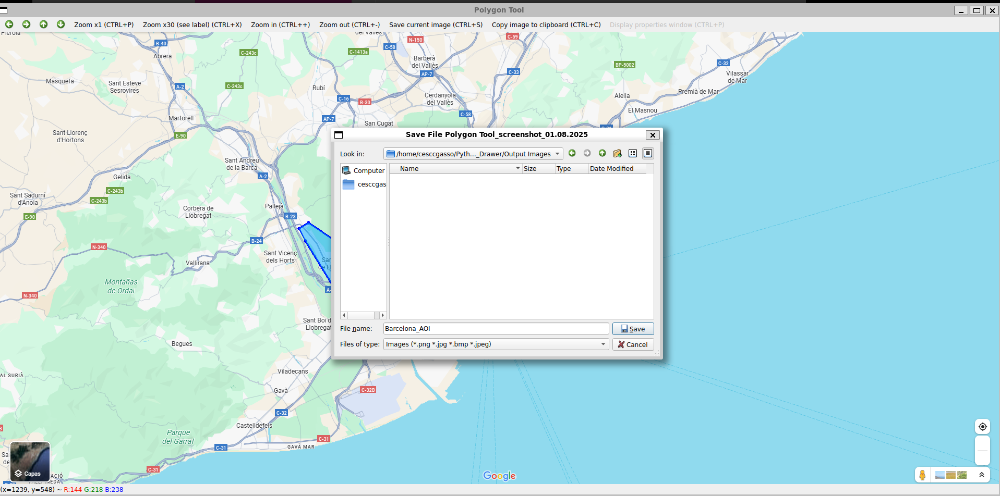

AOI-Drawer - Polygon Tool GUI
==============================

Description
-----------
AOI-Drawer is a simple Python-based graphical tool that allows users to manually define polygonal Areas of Interest (AOIs) on top of a background image. This is specially useful to then extract the shapefiles of the AOI to be analyzed.

The project includes:
- AOI_Drawer.py  : Main class to interactively draw and fill polygons using OpenCV
- main.py        : Entry-point script to launch the tool with a user-defined image


Prerequisites
------------
- Python 3.6+
- OpenCV (cv2)
- NumPy

Install dependencies via pip:
    '''
    pip install opencv-python numpy
    '''

Usage Instructions
------------------
1. Place your target background image (e.g. a satellite image) in:
   /AOI_Drawer/Images/

2. Run the script:
   ```
   python3 main.py
   ```
3. Follow the console prompt to select the image:
   - The script will list all available images.
   - Enter the number corresponding to the desired image.

4. You will see the following GUI.Use the following controls:

   - Left Click     : Add polygon vertex
   - 'z'            : Undo last point
   - 'r'            : Reset image
   - 'Ctrl' + 's'   : Save image 
   - 'q'            : Quit the application  
    
   
   Tip: To complete the polygon, click near the starting point, and then save it as a ".png" file.  
    

   

6. After completion, the filled polygon will be blended into the image with 70% opacity.

NOTES
-----
- Saved images can be written anywhere, but it must be saved as a ".png" file.
- Polygons are drawn with semi-transparent overlay for better visibility.
- Several polygons can be drawn at a time (current version). Press 'r' to start a new one.
